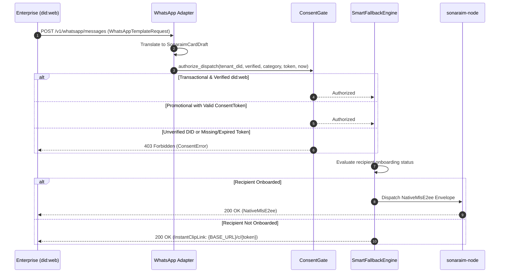
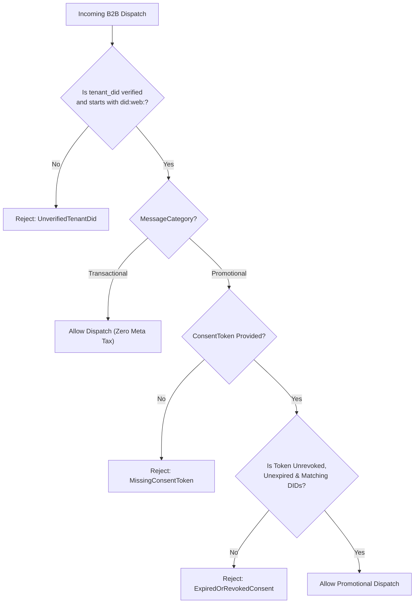

# Architecture Diagrams — `sonaraim-b2b`

> Mermaid sequence and flow diagrams for `sonaraim-b2b`.

## 1. Enterprise Message Dispatch & Consent Gate Sequence

```mermaid
sequenceDiagram
    autonumber
    participant Ent as Enterprise (did:web)
    participant WA as WhatsApp Adapter
    participant CG as ConsentGate
    participant SFE as SmartFallbackEngine
    participant Node as sonaraim-node

    Ent->>WA: POST /v1/whatsapp/messages (WhatsAppTemplateRequest)
    WA->>WA: Translate to SonaraimCardDraft
    WA->>CG: authorize_dispatch(tenant_did, verified, category, token, now)
    alt Transactional & Verified did:web
        CG-->>SFE: Authorized
    else Promotional with Valid ConsentToken
        CG-->>SFE: Authorized
    else Unverified DID or Missing/Expired Token
        CG-->>Ent: 403 Forbidden (ConsentError)
    end
    SFE->>SFE: Evaluate recipient onboarding status
    alt Recipient Onboarded
        SFE->>Node: Dispatch NativeMlsE2ee Envelope
        Node-->>Ent: 200 OK (NativeMlsE2ee)
    else Recipient Not Onboarded
        SFE-->>Ent: 200 OK (InstantClipLink: {BASE_URL}/c/{token})
    end
```

## 2. Consent Gate Decision Tree

```mermaid
flowchart TD
    Start["Incoming B2B Dispatch"] --> CheckDid{"Is tenant_did verified<br/>and starts with did:web:?"}
    CheckDid -- No --> RejectDid["Reject: UnverifiedTenantDid"]
    CheckDid -- Yes --> CheckCat{"MessageCategory?"}
    CheckCat -- Transactional --> AllowTx["Allow Dispatch (Zero Meta Tax)"]
    CheckCat -- Promotional --> HasToken{"ConsentToken Provided?"}
    HasToken -- No --> RejectMissing["Reject: MissingConsentToken"]
    HasToken -- Yes --> CheckRevoked{"Is Token Unrevoked,<br/>Unexpired & Matching DIDs?"}
    CheckRevoked -- No --> RejectInvalid["Reject: ExpiredOrRevokedConsent"]
    CheckRevoked -- Yes --> AllowPromo["Allow Promotional Dispatch"]
```
